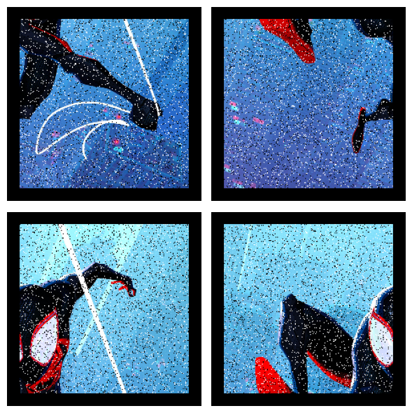
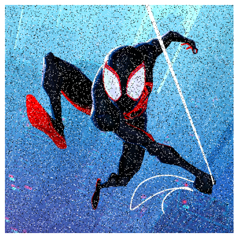
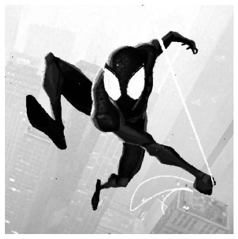
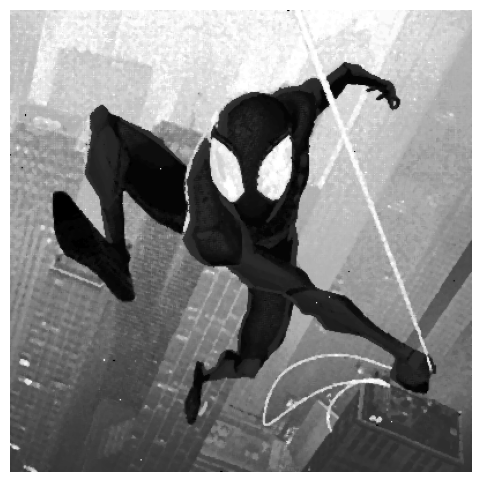
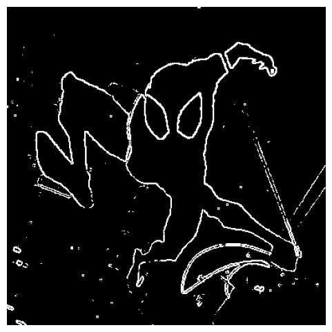
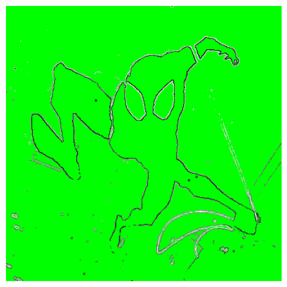

# Respon modul 2 & 3 Kelompok 17 Praktikum PCD 2026

1. Lakukan pada keempat gambar yang diberikan, kemudian tampilkan seperti berikut:
   

2. Hapus border hitam dari keempat gambar kemudian gabungkan keempat gambar tersebut menjadi satu gambar berukuran 400x400 pixel, kemudian tampilkan hasilnya seperti berikut:
   

3. Lakukan suatu proses agar noise pada gambar tersebut hilang, kemudian tampilkan hasilnya seperti berikut: (hint : bukan grayscaling)
   

4. Lakukan ekualisasi histogram pada gambar tersebut untuk meningkatkan kontras pada gambar, kemudian tampilkan hasilnya seperti berikut:
   

5. Ubah gambar tersebut menjadi grayscale, kemudian lakukan deteksi tepi dan thresholding pada gambar tersebut, kemudian tampilkan hasilnya seperti berikut:
    

6. Buat canvas baru dengan warna hijau, gunakan hasil tahap 5 sebagai masking untuk menampilkan hasil simulasi green screen, kemudian tampilkan hasilnya seperti berikut:
    

